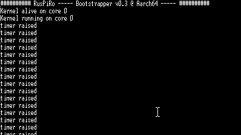

# :man_teacher: Interrupt Handling

If our projects on a Raspberry Pi grow it's more and more unlikely that the whole processing will
follow a linear path. It will need to handle external events that interrupt the actual processing
and need attention to be handled. Those interrupts may also influence how the general process flow
will evolve.

This tutorial demonstrates a simple interrupt handler implementation based in an interrupt raised from
a timer. So for this to work no external device is needed.

## :ticket: Prereqisites
It is assumed that you have at least performed the initial setup as described in [this README](../README.md)
and that you have read the second tutorial [02_CONSOLE](../02_CONSOLE/README.md).

## :running_woman: Quick start
The easiest way to get a basic project struture to begin with is by using an existing project
template. A mimimal version could be found [here](https://github.com/RusPiRo/ruspiro_templates/tree/templates/01_minimal).

To use it you use the following command:
```
$> cargo generate --git https://github.com/RusPiRo/ruspiro_templates.git --branch templates/01_minimal --name hello_interrupt
```

To utilize the features of interrupt handling in your own crate you need the following dependencies
to be setup in the ``Cargo.toml`` file:
```toml
[dependencies]
ruspiro-boot = { version = "0.3", features = [ "ruspiro_pi3", "singlecore" ] }
ruspiro-allocator = "0.3"
ruspiro-interrupt = "0.3"
ruspiro-register = "0.3"
```

> :bulb: **HINT** The ``ruspiro-register`` crate is only needed to define MMIO registers to configure
> the timer. It's not a dependency for proper interrupt handler setup as such.

As the timer interrupt used in this tutorial will only intercept processing on the main core we also
configured the ``ruspiro-boot`` crate this time to be build in "single core" mode which should be
sufficiant for this tutorial. 

## :mailbox: The Kernel File

There is quite a bunch of stuff needed to setup the ARM timer of the Raspberry Pi to generate interrupts
in specific intervall. This does not have directly to do with the interrupt handling it'self but is
required to achieve our goal. So let's start with the timer setup.

> :bulb: **HINT** Please note that the following listings are only provided as code snippets. For the
> full source code check out [kernel.rs](./src/kernel.rs)

```rust
// use the macro to conviniently define a MMIO register
use ruspiro_register::define_mmio_register;

// Define the MMIO registers to be used with the timer, those might go into the
// [ruspiro-timer crate](https://crates.io/crates/ruspiro-timer) in one of the next releases.
define_mmio_register!(
    // the timer load value register, the base address depends on the raspberry model this
    // binare is build for. We assume the model 3(B, B+) here.
    TIMERLOAD<ReadWrite<u32>@(0x3F00_B400)>,
    // the timer control register
    TIMERCTRL<ReadWrite<u32>@(0x3F00_B408)> {
        // with of the timer counting value
        WIDTH OFFSET(1) [
            _16Bit: 0,
            _32Bit: 1
        ],
        // flag to enable interrupts raised by the timer
        IRQ OFFSET(5) [
            ENABLED: 1,
            DISABLED: 0
        ],
        // flag to enable the timer
        TIMER OFFSET(7) [
            ENABLED: 1,
            DISABLED: 0
        ],
        // flag to enable free-running counter of the timer
        FREERUN OFFSET(9) [
            ENABLED: 1,
            DISABLED: 0
        ]
    },
    // timer interrupt acknowledge register
    TIMERACKN<WriteOnly<u32>@(0x3F00_B40C)>
);
```

As we have the MMIO registers defined in our ``kernel.rs`` file we could use them to configure the
ARm timer within the ``kernel_alive`` function like so:
```rust
if core == 0 {
    // when entering here with the main core we setup the timer
    TIMERLOAD::Register.set(0x30_000); // timer re-load value
    // configure the timer being enabled and raising interrupts
    TIMERCTRL::Register.write_value(
        TIMERCTRL::WIDTH::_32Bit
            | TIMERCTRL::IRQ::ENABLED
            | TIMERCTRL::TIMER::ENABLED
            | TIMERCTRL::FREERUN::ENABLED
    );
```

Once we have configure the timer we need to also tell the interrupt manager of the ``ruspiro-interrupt``crate
(this is acting as a depatcher of the interrupts raised to the actual handler function) that we'd like to
dispatch the ArmTimer interrupts. After this is done as well we need to globally activate interrupts
to be triggered at all on the Raspberry Pi:
```rust
    IRQ_MANAGER.take_for(|irq_mgr| irq_mgr.activate(Interrupt::ArmTimer));
    enable_interrupts();
}
```

But wait, we have not provided thew actual interrupt handler, yet. Let's do this before we actually
can test the functionality. To implement the interrupt handler the ``ruspiro-interrupt`` crate provides
a custom attribute (or decorator) for a function that should be used as a handler for a specific interrupt.
```rust
/// Implement the interrupt handler with a specific function attribute/decorator
/// Checkout the [ruspiro-interrupt](https://docs.rs/ruspiro-interrupt/0.3.0/ruspiro_interrupt/irqtypes/enum.Interrupt.html) documentation
/// for all available interrupt types a handler could be implemented for
#[IrqHandler(ArmTimer)]
fn my_timer_handler() {
    // first thing to do is to acknowledge the timer interrupt to clear the interrupt line
    // this is done by writing any value to the acknowledge register
    TIMERACKN::Register.set(0x1);
    // now we are able to perform whatever we want at this interrupt, keeping in mind to return
    // from the handler as soon as possible
    // for the sake of simplicity we just write stuff to the console. BUT be careful:
    // println! will lock the console to be used which might lead to deadlocks in case this interrupt
    // was raised in the middle of another println! However, as we are sure there is no other core
    // doing this, and this is the only active code line at this moment we are on the safe side...
    println!("timer raised");
}
```

In this tutorial we only use the on-time initialization function to implement our functionality. The ``kernel_run`` function could remain untouched or just contain a ``loop {}``.

## :hammer_and_wrench: Building The Kernel

If all tools has been successfully configured ( as described [here](../README.md)), building the
kernel could be done by executing one the following scripts in the projects root folder:
Target Architecture | Windows                  | Linux
--------------------|--------------------------|---------------------------
Aarch32             | <pre>$> make all32</pre> | <pre>$> ./build.sh 32</pre>
Aarch64             | <pre>$> make all64</pre> | <pre>$> ./build.sh 64</pre>

## :computer: Deploy The Kernel

I'd highly recommend to use the bootloader approach as described in the previous tutorials to get the
newly built kernel deployed to the Raspberry Pi. If you are on a Windows machine and you have a terminal
programm installed named **Tera Term** the deployment and immediate call of the terminal programm will
be done like so (assuming you build a 64Bit kernel):
```
$> cargo ruspiro-push -k ./target/kernel8.img -p COM5 && ttermpro /C=5 /BAUD=115200
```

If everything runs fine you should see a console output simmilar to mine:<br>
<br>
The ``timer raised`` text will appear in a constant frequency. Use the value of the ``TIMERLOAD``
register to adjust the intervall the interrupt is raised.
