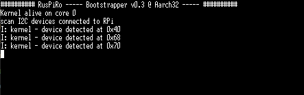

# :man_teacher: The I²C Bus

Beeing able to access the GPIO's to blink a LED or getting stuff written to a console is fine but 
when getting to a point we would like to control external hardware connected to the Raspberry Pi
(e.g. servo motors, sensors) we would need to go the next step and get access to the I²C Bus that is
quite commonly used to control connected devices quite often referred to as "IoT devices".

This tutorial will intoduce the usage of the I²C API.

## :ticket: Prereqisites
It is assumed that you have at least performed the initial setup as described in [this README](../README.md)
and that you have read the second tutorial [00_CONSOLE](../02_CONSOLE/README.md).
In addition it's recommended to connect I²C enabled devices like the **MPU-6050** (a device to mesure
actual orientation), the PCA9685( a 16-channel PWM bridge to drive LED's or servo motors). Ensure
that you properly connect the SDA/SCL/VCC/GND pins of the device with the corresponding GPIO pins 
of the Raspberry Pi. (GPIO2/3 for SDA/SCL)

## :running_woman: Quick start
The easiest way to get a basic project struture to begin with is by using an existing project
template. A mimimal version could be found [here](https://github.com/RusPiRo/ruspiro_templates/tree/templates/01_minimal).

To use it you use the following command:
```
$> cargo generate --git https://github.com/RusPiRo/ruspiro_templates.git --branch templates/01_minimal --name hello_i2c
```

To utilize the I²C API in your own crate you need the following dependencies to be setup in the
``Cargo.toml`` file:
```toml
[dependencies]
ruspiro-boot = { version = "0.3", features = [ "ruspiro_pi3", "singlecore" ] }
ruspiro-allocator = "0.3"
ruspiro-i2c = "0.3"
```

To keep things a bit simpler we also configured the ``ruspiro-boot`` crate this time to be build in
single core mode which should be sufficiant for this tutorial.

## :mailbox: The Kernel File

The first and simplest attempt to utilize the I²C bus is to scan it for any connected device. As the
communication and configuration of each individual device is implementation specific to this device
this tutorial will not cover how to access a specific device and configure it.

```rust
// in addition to the other usages, refer to the I2C crate
use ruspiro_i2c::*;

pub fn kernel_alive(core: u32) {
    // your one-time initialization goes here
    println!("Kernel alive on core {}", core);

    // if the main core is kicked off we can initialize the I2C bus and check for any device
    // connected to the I2C bus using it's [scan()] function
    if core == 0 {
        I2C.take_for(|i2c| {
            // initializing the I2C Bus assuming the default core speed of 250MHz
            i2c.initialize(250_000_000, true).unwrap();
            println!("scan I2C devices connected to RPi");
            let devices = i2c.scan().unwrap();
            for d in devices {
                // using the [info!] macro to write to the console will also print the module name
                // from where the message originates as a prefix to the text
                info!("device detected at 0x{:2X}", d);
            }
        });
    }
}
```
> :bulb: **HINT** The listing above is not complete and shows only the parts code has been changed or added.

In this tutorial we only use the on-time initialization function to implement our functionality. The ``kernel_run`` function could remain untouched or just contain a ``loop {}``.

## :hammer_and_wrench: Building The Kernel

If all tools has been successfully configured ( as described [here](../README.md)), building the
kernel could be done by executing one the following scripts in the projects root folder:
Target Architecture | Windows                  | Linux
--------------------|--------------------------|---------------------------
Aarch32             | <pre>$> make all32</pre> | <pre>$> ./build.sh 32</pre>
Aarch64             | <pre>$> make all64</pre> | <pre>$> ./build.sh 64</pre>

## :computer: Deploy The Kernel

I'd highly recommend to use the bootloader approach as described in the previous tutorials to get the
newly built kernel deployed to the Raspberry Pi. If you are on a Windows machine and you have a terminal
programm installed named **Tera Term** the deployment and immediate call of the terminal programm will
be done like so (assuming you build a 32Bit kernel):
```
$> cargo ruspiro-push -k ./target/kernel7.img -p COM5 && ttermpro /C=5 /BAUD=115200
```

If everything runs fine you should see a console output simmilar to mine:<br>
<br>
The device address list will be different at your end, depending on the I2C devices you've connected.
